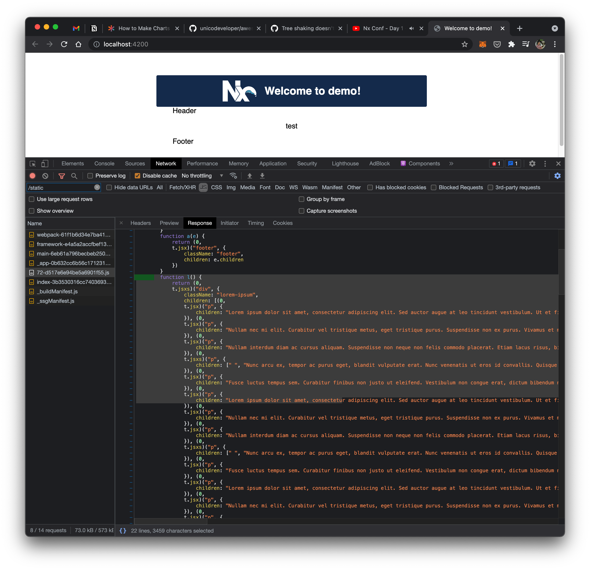

# Reproduction of tree-shaking issue

Install deps:

```bash
npm install
```

Build app:

```bash
npx nx build demo
```

Run prod server:

```bash
npx nx serve demo --prod
```

Check the pages at `http://localhost:4200/` and `http://localhost:4200/about`. The index page does not use the `LoremIpsum` component, however it is still served since it is part of the bundle.



Also note that `LoremIpsum2` is not used anywhere, so it is tree-shaken from the bundle.

Now, add `<LoremIpsum2/>` to `about.tsx`, then run the build + serve steps again. Note that is is now included in the lib bundle, further bloating the network transfers for index page.
